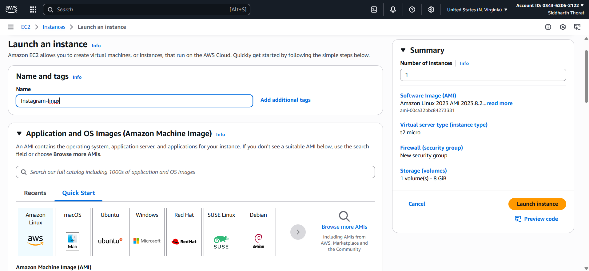
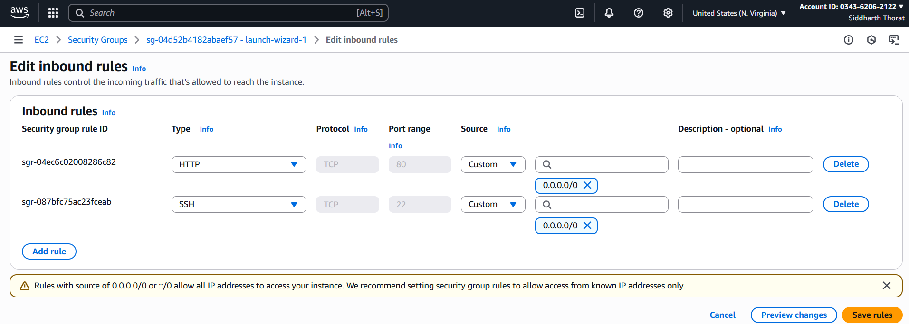
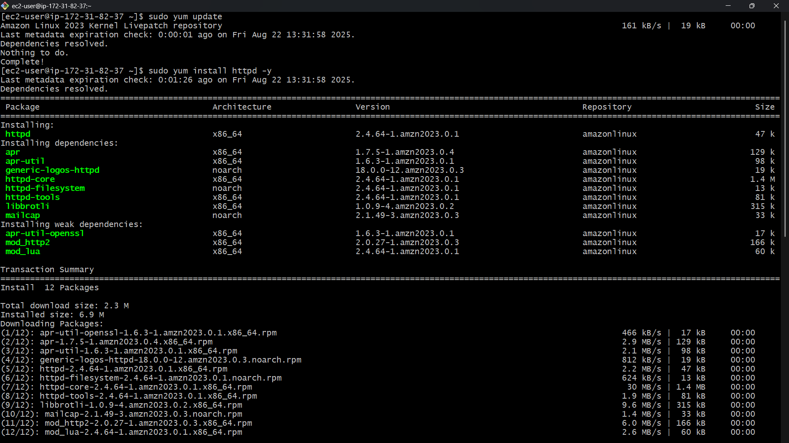
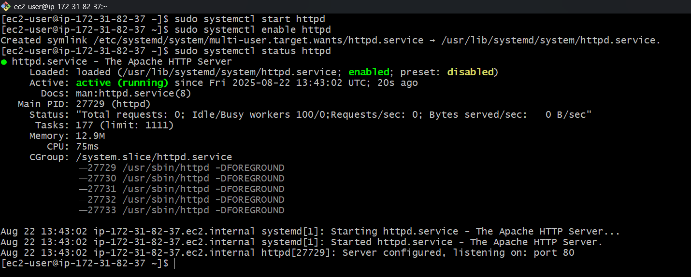
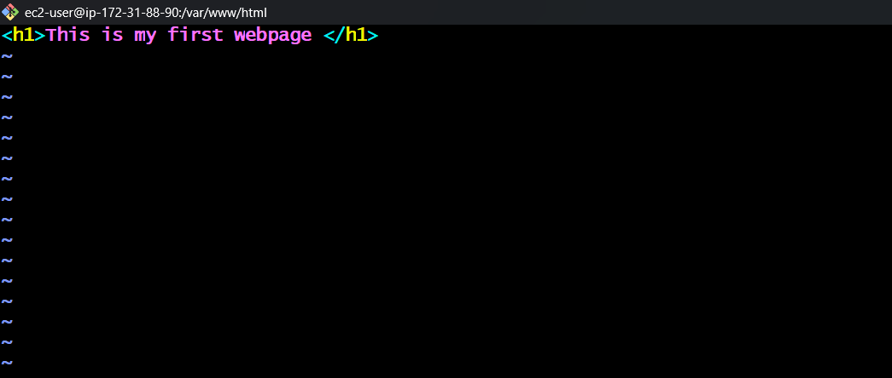
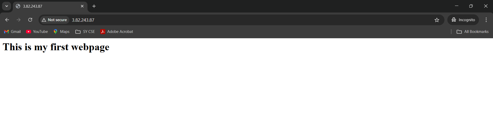

# Static Website Deployment on AWS EC2 with Apache

## Introduction
This project shows how to host a static website on an AWS EC2 instance using the Apache HTTP Server (httpd).
The website is accessible using the EC2 instance’s public IP, with a customized configuration that loads a index.html page.

## Features
1. Deployment of static website on Amazon Linux EC2 instance

2. Apache (httpd) installation and configuration

3. Website accessible directly via public IP

## Technologies Used
- AWS EC2

- Amazon Linux

- Apache HTTP Server (httpd)

- Static HTML page

## Steps to Deploy
### Step 1 - Lanuch an EC2 Instance
- Give the name to the instance
- Select the AMI - Linux
- Select Instance type t2.Micro (free tier eligible)
- Select the ssh key , Security Group and lanuch the instance

### Step 2 - Edit the Security Groups
- Add SSH(22) and HTTP(80) and save the rule

### Step 3 - Connect to the EC2 Instance
- Connect to the ec2 instance by using ssh key
- `ssh -i "your-key.pem ec2-user@<your-ec2-public-ip>`

### Step 4 - Update and Install Apache webserver(httpd) 
- `sudo yum update`
- `sudo yum install httpd`

### Step 5 - Start & Enable Apache and check the status of webserver
- `sudo systemctl start httpd`
- `sudo systemctl enable httpd`
- `sudo systemctl status httpd`

### Step - 6 Create the Project Folder 
- create the project folder inside the html by using vim editor and write the simple code in index.html
- `cd /var/www/html`
- `sudo vim index.html`

### Step - 7 Verification
- Copy the Public IP address of EC2 instance and paste it in the browser. It should return the index.html page.

## Key Learnings

- Hosting and managing static websites on cloud infrastructure.
- Customizing Apache configuration for real-world projects.
- Understanding of server administration and deployment.
